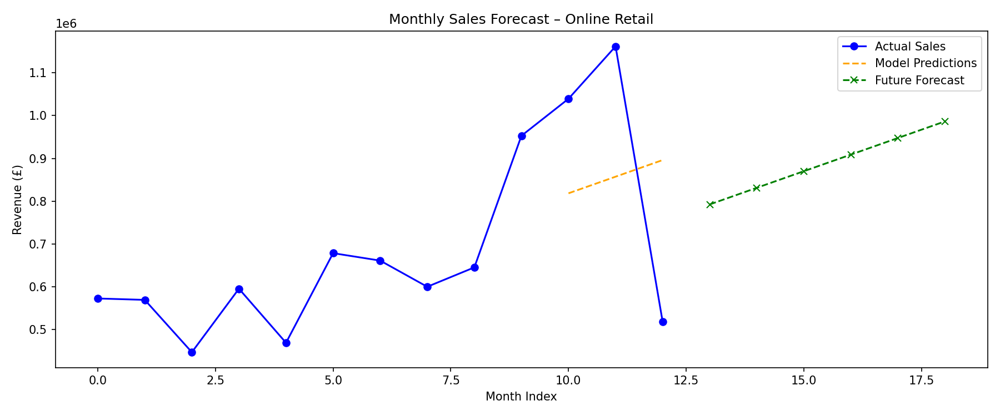

# FUTURE_ML_01 - Sales & Demand Forecasting

## Objective
Predict future monthly sales using the UCI Online Retail Dataset to help businesses plan inventory, staffing, and cash flow.

## Dataset
[UCI Online Retail Dataset](https://archive.ics.uci.edu/dataset/352/online+retail) — Real UK-based transaction data from 2010–2011.

## Tools & Libraries
- Python, Pandas, NumPy
- Scikit-learn (Linear Regression)
- Matplotlib

## What I Built
- Cleaned and prepared 500K+ transaction records
- Engineered time-based features (month, year, seasonality)
- Built a Linear Regression model to forecast monthly revenue
- Evaluated model with MAE and RMSE
- Forecasted next 6 months of sales

## Model Results
- **RMSE:** £307,857
- **Forecast trend:** Revenue projected to grow from £792K → £986K over next 6 months

## What the Forecast Means
The model shows a consistent upward sales trend. After a dip in December, revenue is expected to recover and grow steadily — likely driven by seasonal patterns.

## How a Business Can Use This
- **Inventory planning** — Stock more products in high-revenue months
- **Staffing** — Hire more staff ahead of peak periods
- **Cash flow** — Prepare budgets based on projected revenue
- **Risk reduction** — Avoid overstocking in low-demand months

## Forecast Chart
